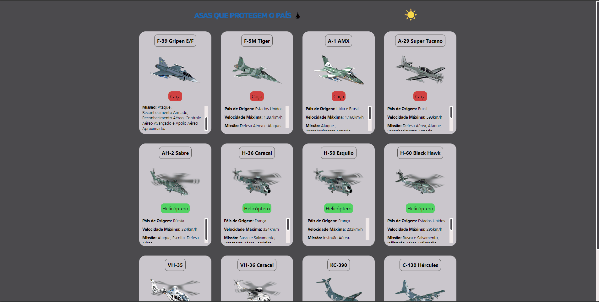

<h1 align="center">Asas Brasileiras</h1>
 

### 🚨 Sobre o Projeto

O projeto é uma página que exibe diversas aeronaves que sobrevoam os céus do Estado brasileiro.

### 🔨 Ferramentas Utilizadas

* [HTML](https://developer.mozilla.org/pt-BR/docs/Web/HTML)
* [CSS](https://developer.mozilla.org/pt-BR/docs/Web/CSS)
* [JavaScript](https://developer.mozilla.org/pt-BR/docs/Web/JavaScript)

### 📽️ Projeto 

</img>